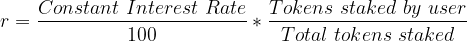
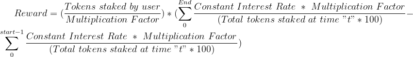

# Staking Contract Specifications

### Links:

* [Contract](contracts/Vault.sol)
* [Tests](test/Vault.ts)

### Reward Calculation

* In the scenario considered the reward varies with total amount of tokens. Each second the reward can be calculated by using the equation below

* To get the total rewards, we can sum up the rewards each second over the time for which the tokens have been staked. If the rewards are calculated every time while the user performs stake and unstake operation, we can assume that the "Tokens staked by user" is constant over that period. 

* The rewards equation can be simplified to this

* The first term inside the brackets has been called `unitRewards` in the contract. It is not user specific and can be calculated every time the total staked amount is updated.

* The second term in the brackets is user specific and needs to be stored after every update to user stake. It has been called `lastUpdatedUnitRewards`. It just assumes the value of `unitRewards` whenever the staked amount of user updates.

* The term `Multiplication Factor` in equation has been used to avoid `unitRewards` to become zero due to solidity's lack of support for fixed point math.

* The term `Tokens staked by user` is stored in `UserStake` struct as `tokenAmount`. `Total tokens staked` is maintained with variable `stakedAmount`. `Constant Interest Rate` is stored in variable `interestRate`.